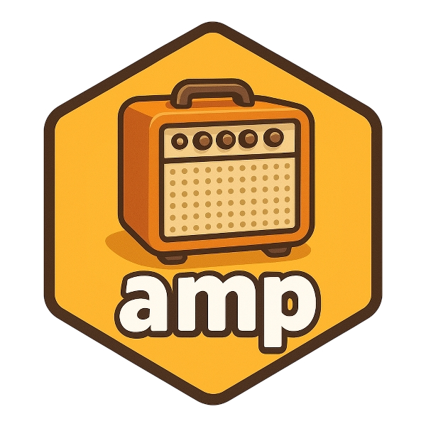

<!-- badges: start -->
[](https://app.codecov.io/gh/LeidenAdvancedPKPD/amp.sim)
<!-- badges: end -->

# Introduction 

There are quite a few R packages available to simulate (pharmacometric) models in R.
This package is not intended to be yet another simulation package, but rather a package that can be used alongside available simulation frameworks.
This means that the package does not include functionality to perform the actual simulations, but rather **amp**lifies it:

1. Automate and streamline simulations within NONMEM
2. Translate NONMEM models to R simulation frameworks (support for  `deSolve`, `rxode2`, `nlmixr2` and `mrgsolve`)
3. Directly create `shiny` applications of (translated) models

Currently the package is under active development and can be installed using:

```R
devtools::install_github("LeidenAdvancedPKPD/amp.sim")
```

The pkgdown website contains various articles on how to use the package and what 
should be taken into account when translating models.

This package was initially developed as an in-house package at LAP&P, and was started in 2017. 
Various versions were developed, where many people within LAP&P helped in making the package better and more robust. 
Without them this package wouldn't be possible!

# Other packages

The main packages in R to perform simulations for pharmacometrics are `nlmixr2` and `mrgsolve`. The `deSolve` package is a 
more general solution which could require some optimization in case of large/complex simulations.
Besides simulations in R, NONMEM is a tool often used to perform simulations as well. Because NONMEM itself is 
low level, R packages like `NMSim` can make these type of simulations much easier. For translating models, there are solutions
like `nonmem2mrgsolve`, `pharmpy` and `nonmem2rx` (called in this package).

This package only amplifies packages like `nlmixr2` and `mrgsolve`. The functionality for NONMEM simulations differ from the 
`NMSim` package. The `amp.sim` package is more low level and has no advanced functionality to start/run NONMEM. 
Implementation is centered towards the dataset, in which a control stream is tailored towards. 
There is an overlap with the model translation options, although this package aims to combine different translations and 
extends this with other simulation tools and possible `shiny` implementation.

# Model translation test

To test how well this package can translate NONMEM models a separate repository is available [here](https://github.com/RichardHooijmaijers/amp.sim.test).
In here dozens of models from the ddmore repository are tested. This test indicate that almost all translations are successful.
The main reason some models could not be fully translated is mainly caused by a subtle difference in model syntax which can be fixed quite easily.


